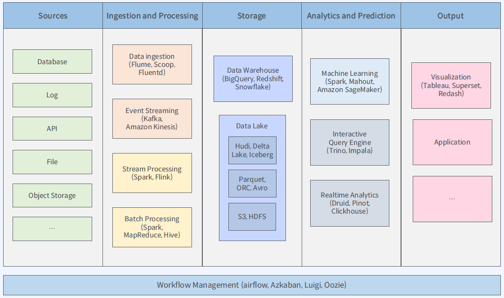

# 빅데이터란?

2025년에 지구에서 생산되는 데이터의 양이 175ZB가 될 것으로 추정 됨.  
분 당 발생하는 데이터의 수가 갈 수록 증가하고 있으며, 상승 속도가 가속화되고 있음.  
기존의 데이터 처리 응용 소프트웨어로는 수집, 저장, 분석, 처리하기 어려울 정도로 방대한 양의 데이터  
혹은, 데이터로부터 가치를 추출하고 결과를 분석하는 기술 그 자체를 의미함.

빅 데이터의 3요소로 Volume, Velocity, Variety가 있음.
* Volume: 데이터의 양
* Velocity: 데이터가 생성되는 시점부터 데이터가 처리되고 사용자에게 결과가 전달될 때 까지 걸리는 시간이 짧은 정도
* Variety: 데이터의 다양성, 다양한 소스로부터 다양한 형태의 데이터

# 빅데이터 플랫폼이란?

## 플랫폼이란?

많은 사람들이 쉽게 이용할 수 있고 다양한 목적의 비즈니스가 이루어지는 공간

## 하드웨어 플랫폼이란?

동일한 제품을 일정한 품질로 만드는 프로세스와 그 제품을 만드는 장치

## 소프트웨어 플랫폼이란?

기반 환경에 무관하게 소프트웨어를 실행할 수 있는 기반이나 환경

## 서비스 플랫폼이란?

서비스 제공자의 서비스를 다른 서비스들이 쉽게 사용할 수 있게 해주는 환경

## 빅데이터 플랫폼이란?

기업 내의 많은 사용자들이 데이터를 처리하고 분석을 쉽게 할 수 있는 환경을 제공해주는 시스템

## 어떤 요구사항이 있는가?

* 데이터 수집, 처리 및 저장
* 데이터 발견, 검색, 보안 제공
* 데이터 분석 및 ML 지원

# 빅데이터 아키텍쳐

데이터 처리는 다섯 단계로 구성됨.  
Sources → Ingestion/Processing → Storage → Analytics/Prediction → Output  
즉, 데이터가 생성되는 곳으로부터 데이터를 수집/처리하고, 그 Rawdata나 결과를 Storage에 저장하고, 저장된 데이터를 분석/예측해서 결과를 도출하는 흐름으로 이어짐.  
이런 데이터의 흐름을 구성하는 것을 "파이프라인"이라 부름.  

## Sources

비즈니스적인 의미를 가진 데이터 소스를 생성하는 단계.  
일반적으로 아래와 같은 형태로 데이터 종류를 구분함.  

* 정형(Structured) 데이터: 미리 정해둔 형식으로 저장 (RDBMS, 스프레드 시트)
* 비정형(Unstructured) 데이터: 정해진 규칙 없이 저장 (텍스트, 이미지, 음성, 영상)
* 반정형(Semi-structured) 데이터: 문법의 형태는 존재하나 형태가 자유로이 저장 (JSON, XML, 웹로그, 센서 데이터)

다양한 형태의 원천으로부터 데이터를 받아올 수 있음: 데이터베이스, 이벤트 컬렉터, 로그, API, 파일, 오브젝트 스토리지, 기타 등  

### 데이터베이스 종류: OLTP vs OLAP

* OLTP
    * 트랜잭션 많음
    * 빠른 처리
    * 정규화된 데이터
    * 테이블 많음
    * 현재 데이터
* OLAP
    * 데이터 많음
    * 느린 쿼리
    * 비정규화 데이터
    * 테이블 적음
    * 이력 데이터

## Data Ingestion and Processing

흔히 ETL이라 부르는 추출/변형/적재가 이루어지는 단계.  

* 배치형 데이터 수집: 이미 존재하는 데이터를 수집, 주기적으로 가져가기 때문에 워크플로의 도움이 필요한 경우가 많음.
    * 데이터베이스
    * 파일
* 스트리밍형 데이터 수집: 지속적으로 들어오는 데이터를 실시간으로 수집
    * 어플리케이션 이벤트
    * 로그
    * 센서 데이터

이를 위한 솔루션 중 대표적으로 아래와 같은 것들이 있음.  

* Flume: 하둡 에코 시스템에서 로그 시스템을 효율적으로 수집/취합/이동시키기 위한 분산 어플리케이션
* Scoop: 하둡 에코 시스템에서 RDBMS 데이터를 HDFS 환경으로 효율적으로 가져오기 위한 솔루션
* Kafka: 대표적인 메시지 브로커 솔루션
* Nifi: 소프트웨어 시스템 간 데이터 흐름을 자동화 해주는 솔루션
* fluentd: 데이터베이스로부터 데이터를 모아주는 오픈소스 수집 프로그램

데이터 처리 단계에서 아래와 같은 솔루션들이 사용 됨.

* 배치 처리: 이미 적재된 대용량의 데이터를 처리
    * MapReduce
    * Spark
    * Hive
* 스트림 처리: 실시간으로 들어오는 데이터를 처리
    * Flink
    * Spark
    * Kafka

데이터를 처리한 후에는 데이터 레이크/데이터 웨어하우스 등의 저장소에 저장하게 되는데,  
기존의 배치 처리의 경우 빠르게 데이터를 적재하는 데에 애로사항이 있었음.  
최근 웹 환경에서는 스트림 처리가 선호됨.  
스트림 처리의 단점도 있는데, 수정이 어렵고(과거의 데이터를 수정하기 힘듬), 지연된 데이터를 처리하는 상황(순차적으로 들어와야 하는 데이터의 입력 순서가 꼬이는 경우)에 취약함.  
때문에 두 처리 방식의 장점만을 취하는 형태의 아키텍쳐가 소개되고 있는데, 두 가지가 있음.

### 람다 아키텍쳐

> 배치 처리와 스트림 처리를 모두 하기 위한 구조.  
3개의 레이어로 구성: 배치 레이어 + 서빙 레이어 + 스피드 레이어

* 배치 레이어  
대용량 데이터의 배치 처리를 위한 프로세스를 돌림.  
데이터를 처리하는 단위(unit)로 데이터가 입력되면 해당 단위로 데이터 처리를 하게 되는데, 단위 프로세스로 처리되기때문에 해당 단위의 처리시에 이후에 들어온 데이터는 처리하지 못함.  
특정 단위의 배치 프로세스이기 때문에 데이터의 정합성이나 충돌, 동시성, 이상현상, 장애등에 대해 비교적 안전함.
* 스피드 레이어  
배치 레이어가 특정 단위작업 이후에 들어오는 실시간 데이터를 처리하지 못하기 때문에, 이를 처리하고 응답시간을 빠르게 유지하는 역할을 하는 레이어.  
스트림으로 들어온 데이터를 처리하기 위한 큐나 버퍼같은 구조를 사용하고 효율적 스트림 처리를 위한 증분 처리 방식을 사용.  
배치 프로세스가 완료된 시점에는 처리된 실시간 뷰는 삭제.
* 서빙 레이어  
배치레이어와 스피드레이어를 통해 처리된 배치뷰와 실시간뷰를 병합하여 사용자에게 결과값을 제공해주는 계층.

단점으로는, 연산 포인트가 둘로 나뉘기 때문에 운영/관리 상에서의 난이도가 높아짐.

### 카파 아키텍쳐

> 람다 아키텍쳐의 기능 중복과 복잡함을 제거하기 위한 구조.  
두 개의 레이어로 구성: 스피드 레이어 + 서빙 레이어  

배치 레이어를 제거하고 스피드 레이어에서 모든 데이터를 스트림 처리하여 서빙 레이어로 전달하는 구조.  
스피드 레이어에서 대용량 데이터를 실시간으로 처리/분해하여 그 결과를 실시간으로 서빙 레이어로 전달하는 형태로 동작함.  
가장 중요한 포인트는 데이터가 분해되어도 데이터는 멱등성을 지녀야 함(여러 번 연산을 해도 항상 같은 결과가 나와야 함).  
메시지 브로커가 다양한 기능을 수행해야 하는데, 데이터에 문제가 발생했을 경우를 대비해 브로커 측에서 데이터를 충분히 오래 들고 있으며, 필요할 시 롤백 기능도 제공해야 함.  

단점으로는, 대량의 과거 데이터를 다시 봐야할 때 평상시보다 대량의 부하가 걸림.  
클라우드 서비스의 자동 스케일링과 로드 밸런싱으로 완화시킬 수 있음.

## Storage

앞 단에서 처리한 데이터를 적재하는 단계.  

* 데이터 웨어하우스  
저장 전 데이터에 미리 정의된 스키마를 적용하며, 이 저장소에 저장하기 전에 데이터를 정리하고 구성해야 함.  
이미 정제된 데이터이기 때문에 검색이 빠름.  
일반적인 RDBMS의 경우 테라바이트 이상의 데이터를 적재하게 되면 성능 저하가 발생하는데, 아래와 같은 클라우드 기반 솔루션들에서는 페타바이트 단위의 적재를 보장함.
    * Google BigQuery
    * Amazon RedShift
    * Snowflake (SaaS, 구동에 타 클라우드 서비스 필요)
* 데이터 레이크  
데이터를 원천 형태 그대로 저장하며, 다양한 형태의 데이터를 저장할 수 있음.  
    * (구) Amazon S3, HDFS 등 클라우드 오브젝트 스토리지
    * Hudi
    * DeltaLake
    * Iceberg

최근에는 데이터 레이크에서 데이터 웨어하우스처럼 강력한 관리 기능을 탑재한 데이터 레이크하우스라는 개념이 새로이 등장함.  

## Data Analytics and Prediction

데이터 사이언티스트들이 쿼리를 통해 데이터를 다방면으로 분석하는 단계.  

주로 아래와 같은 대화형 쿼리 엔진을 통해 데이터를 제공.  

* Trino
* Presto
* Impala

실시간 분석을 위한 솔루션으로 아래와 같은 제품들이 있음.  

* Druid
* Pinot
* ClickHouse

머신 러닝을 위한 솔루션들은 아래와 같다.

* Spark
* Amazon Sagemaker
* Azure Machine Learning
* Google Cloud AI

## Output

데이터를 시각화하고 결과를 실제 어플리케이션에 적용하는 단계.  
이 단계의 목적은 데이터 기반으로 의사 결정을 돕는 역할이 첫 번째이고, 어플리케이션에서 데이터의 도움을 받아 프로덕트를 향상시키는 것이 두 번쨰임.

대시보드로 아래와 같은 솔루션이 있음.

* Tableau
* Superset
* Redash

## Workflow Management

각 단계는 데이터의 흐름으로 연결되어야 하고(파이프라인), 파이프라인 자체에 대한 오케스트레이션, 스케쥴링, 상호 의존관계 구성 등의 작업이 필요함.  
이 작업을 돕는 툴은 주로 정기적으로 특정 태스크를 실행하거나, 비정상 동작을 파악하고 정상 동작으로 돌리는 것을 지원함.

* Airflow
* Luigi
* Oozie
* Azkaban