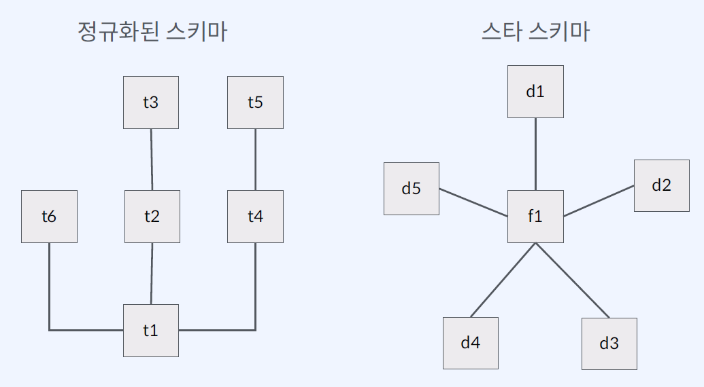

# 데이터 파이프라인

파이프라인이란, 하나의 데이터 처리 단계의 출력이 다음 단계의 입력으로 이어지는 형태로 연결된 구조.  
대표적으로 유닉스 파이프라인이 있음. 아래의 이미지는 텍스트 파일이 화면으로 출력되는 과정을 묘사.  

데이터 파이프라인이란, 다양한 소스에서 데이터를 변환하고 옮기는 일련의 과정을 구성한 시스템!
Source → Processing → Destination 의 구성.  
아래 예시는 로그 파일을 저장소에 저장하고, 가공하여 데이터 웨어하우스로 옮기는 데이터 파이프라인을 묘사.

## 왜 데이터 파이프라인을 쓰는가?

* 데이터 기반 의사 결정
    * 비즈니스 데이터 분석
    * 리포팅
* 데이터 기반 어플리케이션
    * 머신러닝
    * 데이터 사이언스

## 누가 데이터 파이프라인을 구축하는가?

## 어떻게 데이터 파이프라인을 구축하는가?

1. 배치 프로세싱을 통한 데이터 수집 및 쿼리, 시각화를 수행하는 아키텍쳐  

2. 데이터 팀에서 다양한 소스로부터 데이터를 불러와 적재/시각화까지 지원하는 플랫폼의 아키텍쳐

# 데이터 파이프라인 패턴

데이터를 저장할 때, 기존 RDBMS의 경우 정규화 된 형태의 스키마를 사용한다.  
하지만 정규화 스키마는 데이터 웨어하우스에서는 적합하지 않았는데, 데이터 쿼리에 너무 많은 시간이 걸렸음.  
때문에 데이터 웨어하우스에서는 대량의 데이터 안에서 쿼리 성능을 향상시키기 위해 스타 스키마를 적용함.  

스타 스키마는 위 그림과 같이 비즈니스 처리 데이터를 fact들로 분리하고 fact 테이블의 필드와 관련된 정보를 담는 dimensions 테이블로 연결함.  
전통적인 RDBMS 제품을 그대로 사용할 수 있음.  
정규화 수준이 낮기 때문에 조인 연산이 거의 필요하지 않고 쿼리문도 간단해지며 쿼리 성능도 올라가는 장점이 있지만,  
처음 정의한 fact 기준의 단순 탐색을 위한 목적이 아닌 다른 용도로 사용하기가 어려우며, 정규화 수준이 낮아 데이터 중복이 발생하기 쉬워 적재 시 성능이 좋지 못함.

## ETL

이렇게 정의 된 데이터 웨어하우스에 데이터를 적재하는 행위를 ETL이라 함.  
Extract → Transform → Load 시퀀스의 줄임말임.  

소스에서 가져오는 데이터가 데이터 웨어하우스에서 정규화 된 형태가 아닐 것이 분명하기 때문에, 데이터 웨어하우스에 넣기 위해 변환하는 작업이 필요함. 때문에 Transform 단계가 있음.  

## ELT

반대로, 데이터를 추출해서 변환하지 않고 선 적재, 후 처리 형태의 시퀀스도 존재하며, 이를 ELT라 표현함.  
Extract → Load → Transform 시퀀스의 줄임말임.  

데이터의 형태가 굉장히 다양해지고 양도 기하급수적으로 늘어났기 때문에, 데이터 적재 전에 처리할 수 있는 수준을 넘어섰기 때문에 이런 형태의 시퀀스가 탄생함.  
이 경우 소스 데이터를 날 것 그대로 저장해야 할 필요가 있기 때문에, 데이터 레이크가 그 역할을 수행하고 있음.  
때문에 최근 데이터 처리 추세는 ETL에서 ELT로 바뀌는 추세.

# 데이터 레이크

데이터 레이크는 구조화되거나 반구조화되거나 구조화되지 않은 대량의 데이터를 저장, 처리, 보호하기 위한 중앙 집중식 저장소임.  
데이터를 저장하기 전에 정해진 형태로 맞추는 데이터 웨어하우스와는 다름.  

데이터 저장 형태는 아래와 같은 3단계로 구분함.  

* 1 단계: 원본 데이터
* 2 단계: 분석용 데이터
* 3 단계: 피처 데이터(ML, AI) / 집계 데이터

# 데이터 레이크 vs 데이터 웨어하우스

# 데이터 파이프라인 오케스트레이션

## 오케스트레이션이란?

여러 개의 컴퓨터 시스템,어플리케이션 또는 서비스를 조율하고 관리하는 것.  
주 역할은 복잡한 태스크와 워크플로를 쉽게 관리할 수 있도록 도움.  

아래 데이터 파이프라인의 예시를 다시 보고 이야기해보자.  

이런 아키텍쳐로 시스템을 구성하면, 다양한 데이터를 처리하고 저장함.  
위 그림에서 화살표는 태스크 하나를 의미하며, 하나의 데이터 유닛이 마지막까지 처리되는 시퀀스를 워크플로라고 표현함.  
이런 워크플로를 스크립트로 작성해서 실행시킬 수 있지만, 아래와 같은 단점이 있음.  

* 워크플로가 복잡
* 태스크의 의존 관계가 복잡
* 실패 시 처리 어려움

때문에, 워크플로를 관리하는 도구는 아래 기능을 보장해야 함.  

* 스케줄링
* 태스크 의존 관계 정의
* 실행 결과 알림 및 보관
* 실패 시 재실행

## 스케쥴링 + 태스크 의존 관계 정의: DAG

대부분의 태스크의 의존 관계를 표현하는 그래프. 아래 예제를 보자.  

그래프의 화살표에는 방향이 존재하며, 다시 시작 점으로 돌아올 수 없음(사이클이 존재하지 않음).  
대표적인 워크플로 관리 툴인 Airflow는 파이썬으로 워크플로를 정의하는데, 아래와 같은 형태를 따른다.  

## 실행 결과 알림 및 보관

Airflow나 Oozie나, 자체 시스템 안에 데이터베이스를 보유하고 각 태스크의 실행 여부와 그 결과를 보관함.  

또한 각 툴은 특정 태스크가 완료될 때 알림 기능을 제공함.  
실패할 경우에는 이메일을 보내거나, 정상 종료 로그를 모아 특정 태스크의 실행 시간을 파악할 수도 있음.  

## 실패 시 복구 방법

* 재시도  
네트워크 이슈 등의 일시적인 문제를 해결하기 좋음.  
자동으로 재시도를 함으로써 일시적인 문제를 없던 것으로 만들 수 있음.  
데이터의 오염으로 인한 재시도의 경우 계속 같은 오류를 내뱉을테니, 태스크의 특성에 따라 재시도 횟수 제한 등의 조치가 필요함.
* backfill  
일정 기간 동안의 워크플로를 재실행하는 기능.  
과거 일정 기간의 태스크가 계속 실패했을 경우의 디버깅이나, 신규 태스크를 추가했을 때 테스트를 위해서도 사용이 가능.  
