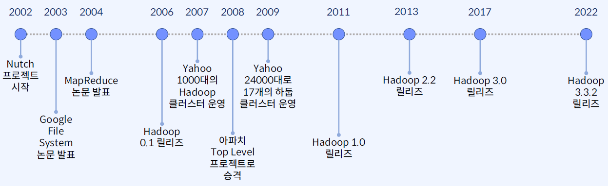
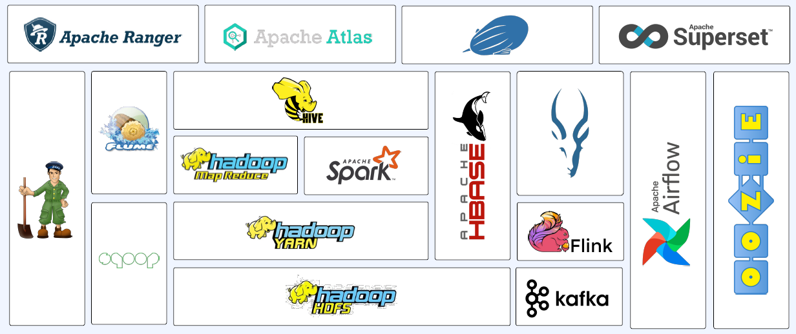
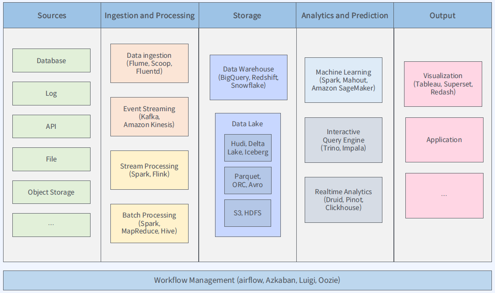
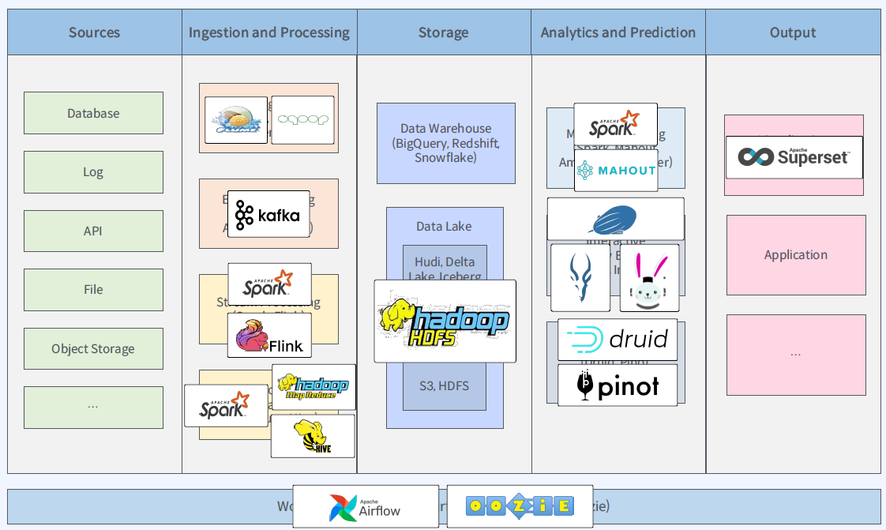
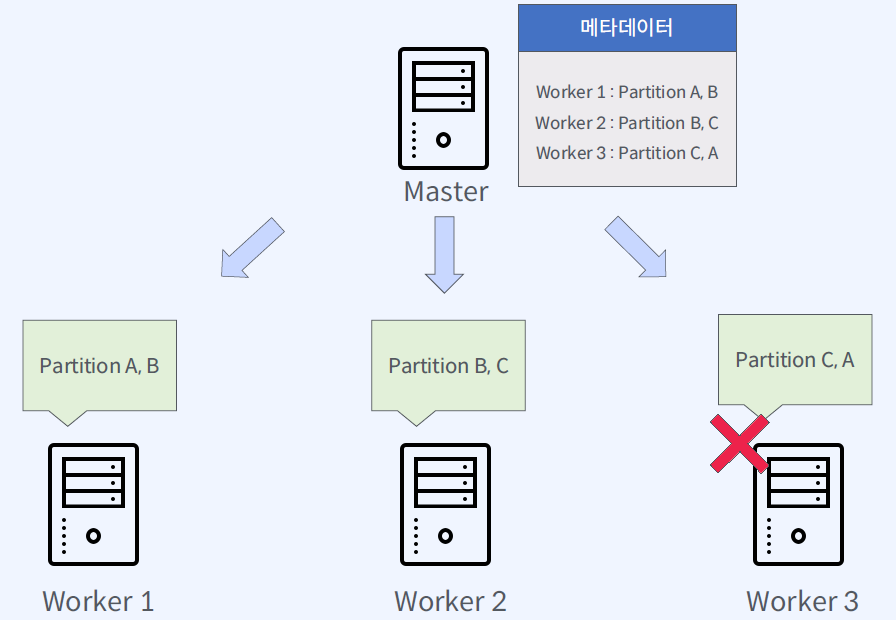

# 하둡 에코시스템

하둡 에코시스템은 많은 양의 데이터를 보관하기 위한 스토리지와 분산 분석 기능을 제공하기 위한 여러 소프트웨어의 집합체.  

* 분산 파일 시스템: HDFS(Hadoop Distributed File System)
* 리소스 관리자: YARN(Yet Another Resource Negotiation)
* 분산 데이터 처리: MapReduce

## 수집 관련 프로젝트

* Flume
* Sqoop
* Nifi
* Kafka

## 데이터 처리 관련 프로젝트

* Hive
* MapReduce
* Spark
* Impala
* Flink
* Kafka

## 데이터 적재 관련 프로젝트

* HDFS
* HBase

## 분산 환경 관련 프로젝트

* Zookeeper

## 워크플로 관리 프로젝트

* Airflow
* Oozie

## 보안 관련 프로젝트

* Ranger

## 메타데이터 관리 프로젝트

* Atlas

## 웹 기반 노트북 지원 프로젝트

* Zeppelin

## 웹 기반 데이터 시각화 지원 프로젝트

* Superset

# 빅데이터 플랫폼과 하둡 에코시스템 비교

이전 강의에서 소개한 빅데이터 플랫폼은 아래의 형태를 따름.  

하둡 에코시스템의 요소들을 위 그림에 배치해보면 아래와 같음.  

# 하둡 클러스터 구축 고려사항

클러스터란, 여러 대의 컴퓨터들이 연결되어 하나의 시스템처럼 동작하는 컴퓨터들의 집합.  
미리 정의된 게이트웨이를 통해 접속이 들어오게 되면, 마스터 노드에서 해당 로드를 워커 노드로 분배하는 형태.  

하둡 클러스터는 scale-out을 목표로 하는 아키텍쳐를 가지며, 워커 노드를 늘리는 것으로 쉽게 클러스터의 연산 파워를 올릴 수 있음.  
마스터/워커 아키텍쳐에서, 마스터 노드는 특정 태스크의 담당 노드를 하나만 지정하지 않음.  
워커 노드에서 여러 태스크를 담당하게 함과 동시에 다른 노드와 담당을 겹치게 지정함으로서 특정 노드가 죽었을 경우에 태스크의 누락이 없도록 함.  

## 클러스터의 규모 결정하는 법

* 스토리지 용량으로 결정
    1. 저장 될 데이터 크기 예측
    2. 복제 전략 결정
    3. 저장 기간 고려
    * 예시)
        1. 저장 될 데이터 크기 예측: 하루에 저장되는 데이터의 크기는 1TB
        2. 복제 전략 결정: 3
        3. 저장 기간 고려: 3년
        4. 필요한 노드 수 결정
            * 서버 한 대의 저장 용량: 5TB * 12
            * 약 70대
    * Optional) 추가 고려 사항
        * 데이터 포맷
        * 데이터 압축 여부
        * 데이터 증가율의 변화
* 데이터 수집 속도로 결정
    1. 데이터 수집 속도 예측
    2. 데이터 처리 속도 예측
    * 예시)
        * 1TB 데이터 분석
        * 5분 이내에 결과를 저장
        * 쓰기 속도는 디스크당 50MB/s
        * 디스크 70개가 병렬로 써야 함
        * 서버 당 디스크가 24개 씩 있는 경우
        * 약 3대의 서버가 필요