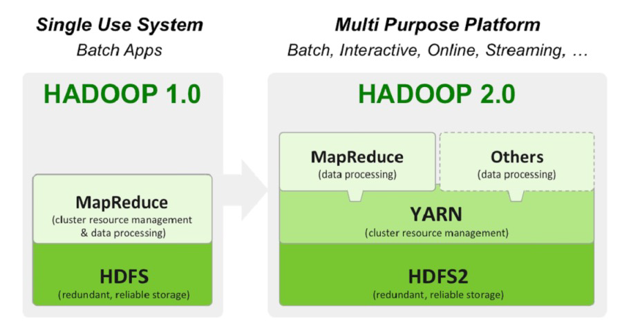
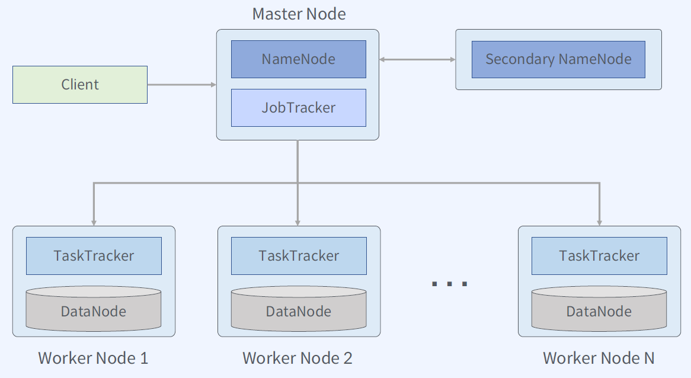
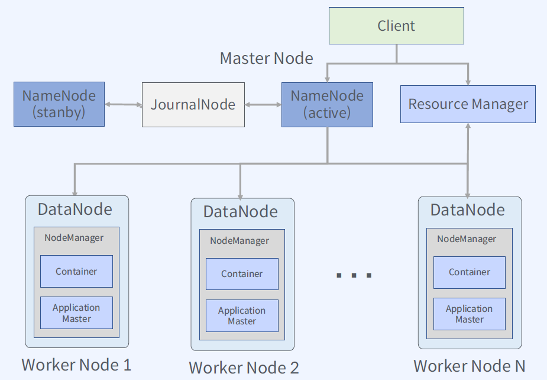
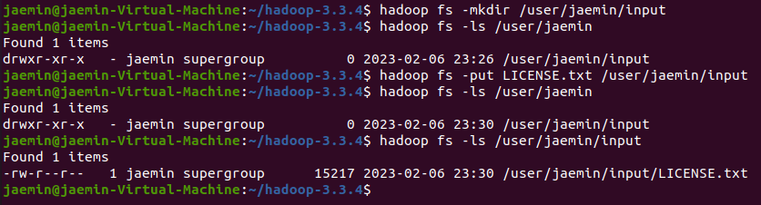

# 하둡 구성

하둡은 다수의 소프트웨어로 구성된 프레임워크.  
하둡 2.XX 버전부터는 하둡 HDFS(파일 시스템), MapReduce(데이터 처리), YARN(리소스 관리) 세 개의 구성요소로 이뤄짐.  
하둡 에코시스템은 하둡과는 독립적으로 개발. 때문에 하둡 에코시스템의 구성요소들은 하둡에 의존성이 없는 경우가 많음.  

하둡 1.XX 버전에서는 YARN이 없어 HDFS와 MapReduce가 직접 연결되었고, 때문에 다른 소프트웨어를 통한 데이터 처리 아키텍쳐를 구성하기가 어려웠음.  
YARN의 등장으로 다른 데이터 처리 소프트웨어를 쉽게 구성할 수 있게 됨.  

아래 그림은 하둡 1.XX 버전의 아키텍쳐. 다음과 같은 문제가 있음.  
1. 네임 노드가 SPOF임.
2. 각 워커 노드에서 도는 데이터 노드가 유연성이 없음. 다른 소프트웨어의 사용이 불가.

때문에 이를 개선하기 위해 하둡 2.XX 버전에서 아래와 같은 아키텍쳐로 변경됨.  

# HDFS에 대해

## 분산 파일 시스템이란?

네트워크로 연결된 여러 머신의 스토리지를 관리하는 파일 시스템.  

네트워크로 접속하기 때문에 접속 불량이 일어날 수 있으며, 파일 시스템 중 특정 머신/노드에서 오류가 발생할 가능성도 있음.  
이러한 문제점을 잘 커버하는 시스템이 좋은 파일 시스템이라 할 수 있음.  

## GFS(Google File System)

2003년에 소개되었으며, 마스터/워커(청크) 구조의 아키텍쳐를 채택함.  
클라이언트가 마스터 서버에게 특정 파일을 요청하면, 마스터 서버는 클라이언트에게 해당 파일의 위치나 핸들을 제공함.  
이후 클라이언트가 청크 서버에 직접 접속해서 파일을 만지는 방식.  

이 컨셉을 기반으로 HDFS가 탄생하게 됨.  

## HDFS(Hadoop Distributed File System)

* 범용 하드웨어를 사용하여 분산 파일 시스템 구성
* 블록 단위 저장
* 마스터/워커 구조
* 내고장성(Fault-tolerance) 제공
* 확장성 제공

### HDFS 블록 

* 하나의 파일을 여러 블록으로 저장
* 하둡 2에서는 기본 블록 사이즈가 128MB (하둡 1은 64MB)
* 실제 파일 크기가 블록 사이즈보다 작은 경우 파일 크기 만큼만 디스크 사용

왜 블록 형태를 채용했지?

* 파일 하나의 크기가 실제 하나의 물리 디스크 사이즈보다 커질 수 있음 (파일 2TB, 하드 1TB)
* 스토리지 관리 단순화
* 내고장성과 가용성을 지원하는 복제 기능 지원 적합 (블록 단위로 다른 노드에 레플리카 생성이 쉬움)

블록 사이즈가 왜 이렇게 크지?

* 탐색 비용 최소화
* 블록의 시작점을 탐색하는데 적게 걸림
* 메타 데이터 크기 감소

### 네임 노드, 데이터 노드

* 네임 노드: 파일 시스템의 네임스페이스를 관리.(= 마스터)  
파일 시스템 트리와 그 트리에 포함된 모든 파일과 디렉터리에 대한 메타데이터를 유지하는데, 이 정보는 네임스페이스 이미지(namespace image)와 에딧 로그(edit log)라는 두 종류의 파일로 로컬 디스크에 영속적으로 저장됨.  
파일에 속한 모든 블록이 어느 데이터노드에 있는지 파악하고 있음. 하지만 블록의 위치 정보는 시스템이 시작할 때 모든 데이터 노드로부터 받아서 재구성하기 때문에 디스크에 영속적으로 저장하지는 않음. 
* 데이터 노드: 파일 시스템의 실질적인 일꾼.(= 워커)  
데이터 노드는 클라이언트나 네임노드의 요청이 있을 때 블록을 저장하고 탐색하며, 저장하고 있는 블록의 목록을 주기적으로 네임 노드에 보고함.  

때문에 시스템을 안정적으로 유지하기 위해서는 네임 노드의 이중화가 필수적인데, 하둡 2.XX 까지는 두 개의 노드를 운영함(3.XX 버전부터는 2개 이상으로 이중화 기능 지원).  
두 개를 기준으로 얘기할 때, 단순한 Active-Standby 형태가 아님. 아래와 같은 시퀀스로 두 노드가 합작하여 네임스페이스 이미지를 관리함.  

1. 프라이머리 노드에서 이미지를 가지고 있고, 파일 시스템에 어떤 변경사항이 있을 때 마다 에딧 로그를 작성.  
2. 특정 시점에 프라이머리 노드는 이미지 복사본과 에딧 로그 원본을 세컨더리에게 넘기고, 자신은 에딧 로그를 삭제. 이후 시스템 중단 없이 새 에딧 로그에 계속 활동을 기록함.
3. 세컨더리 노드는 이미지 복사본과 에딧 로그를 받아 새 이미지를 생성하고 프라이머리로 전달.
4. 프라이머리는 이전 버전의 에딧 로그 적용이 완료된 이미지를 확보하게 됨.

## HDFS의 High Availability 전략

## HDFS의 읽기/쓰기

# 하둡 설치

1. Jdk 설치
2. 비밀번호 없는 ssh 통신이 가능하게 설정  
(openssh-server 설치 및 ssh-keygen으로 키 생성 + 키 등록)
3. 하둡 바이너리 다운로드 및 압축 해제
4. .bashrc 파일에 JAVA_HOME, HADOOP_HOME 등 환경 변수를 shell 킬 때 마다 등록하도록 셋업 + 적용
5. etc/hadoop/ 폴더 내의 core-site.xml, hdfs-site.xml, mapred-site.xml, yarn-site.xml 셋업
6. 네임노드 초기화 (`hdfs namenode -format`)
7. sbin/ 폴더 내의 start-dfs.sh, start-yarn.sh 쉘 실행시켜 jps 입력했을 때 아래와 같이 출력이 되어야 함.  

# 하둡 CLI

https://hadoop.apache.org/docs/stable/hadoop-project-dist/hadoop-common/CommandsManual.html

hadoop fs 혹은 hdfs dfs 명령어로 하둡 파일 시스템에 접근이 가능하며, 패러미터로 리눅스 기반 파일 탐색 명령어를 사용하면 동일한 효과를 볼 수 있음.  

* hadoop fs -mkdir {directory}: {directory} 경로의 디렉토리 생성
* hadoop fs -ls {directory}: {directory} 경로의 파일 목록 출력

