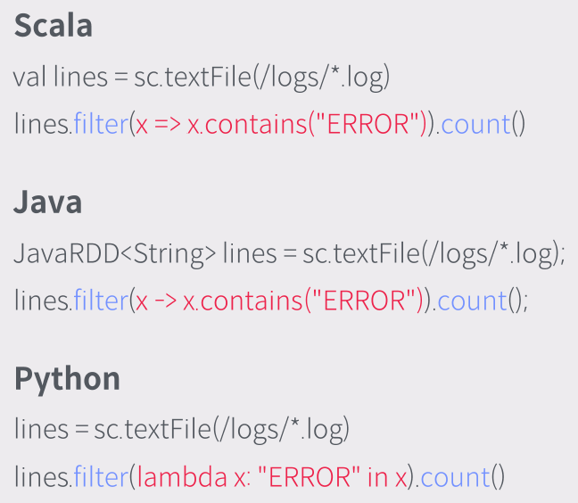

# Apacke Spark (= 아파치 스파크)

스파크는, 빅 데이터에 대한 컴퓨팅 연산을 다수의 서버로 구성된 클러스터에서 분산 병렬 처리하기 위한 오픈소스 엔진.  
물론 싱글 노드 환경에서도 병렬 처리 엔진으로 쓰는 것도 가능.  

* 데이터를 모아서 진행하는 배치 작업
* 구조화된 데이터를 가지고 하는 SQL 작업
* 지속적으로 발생하는 데이터를 적재 없이 처리하는 스트리밍 작업
* 분산 환경에서 대용량의 데이터를 기반으로 한 머신러닝 학습 및 추론 작업
* 그래프 데이터에 대한 병렬 연산

위 작업들을 하나의 엔진 안에서 처리할 수 있음.  
스파크는 저장소가 아니라서 외부의 데이터를 읽어 처리한 결과를 외부에 저장하는 형태임.  
외부 데이터 저장소는 파일 시스템과 데이터베이스를 가리지 않음.  
코드 레벨에서 분산 관련 고민을 할 필요를 덜어줌. 스파크가 제공하는 High-level API를 사용하면 스파크가 알아서 노드에 작업을 분산해줌.  

## 스파크 아키텍쳐

스파크는 분산 환경에서 연산 작업을 하는 것을 목표로 설계되었지만, 스파크 자체가 노드 별 자원 관리를 직접 하지는 않음.  
쿠버네티스, YARN, 메소스 등의 클러스터 매니징 솔루션을 통해 이를 진행함.  

굳이 이를 사용하지 않아도, 배포판에는 가벼운 버전의 클러스터 매니징 솔루션인 Spark Standalone 이라는 서비스를 포함함.  
Spark Core는 작업 스케쥴링 및 오류 시 데이터 복구, 가용성 확보 전략을 포함함.  
Spark Core 위에서 실제 연산을 수행하기 위한 많은 라이브러리들이 존재함.  
이러한 라이브러리들이 밖으로 드러나있지는 않고, 사용자는 API를 통해 스파크에 작업을 던져줄 코드를 짜게 되면 내부에서 알아서 돌아가는 형태.  

## 스파크 특징

* In-Memory 컴퓨팅 (Disk 기반도 가능)
* RDD(Resilient Distributed Dataset) 데이터 모델
* 대화형 질의를 위한 Interactive Shell 지원
* Realtime Stream Processing

## RDD란?

`Resilient Distributed Dataset.`  

* Resilient: 클러스터의 한 노드가 실패하더라도 다른 노드에서 작업 처리
* Distributed: RDD 안의 데이터는 클러스터에 자동 분배
* Dataset: 분산 저장된 변경 불가능한 데이터 객체 모음

RDD 측에서 제공하는 동작 API는 두 가지임.  

* Transformations: 데이터 변형 (map, filter, groupBy, join)  
이 경우, Action 실행 전까지 실제 변형은 미뤄두고, Action이 call 되면 그 때 변형을 수행함.  
왜냐? 여러 변형 동작이 중복되거나 사용되지 않을 수 있으므로, 최적화를 위해 변형 동작을 DAG로 구성하여 최대한 적은 연산을 수행하게 함.  
* Actions: 결과 연산 및 리턴 (count, collect, save)

RDD의 일반적인 데이터 처리는 3단계로 이뤄짐: 생성, 변형, 연산  
보다 상세한 과정은 아래와 같음.

1. 맨 처음에 데이터를 확보함. 그림에서는 로그 파일.
2. 사용자가 원하는 만큼 데이터를 변형하는데, 이 때 마다 새로운 RDD 데이터가 생성됨.
3. 최종적으로 변환이 끝난 RDD 데이터를 Action API를 call해서 처리함.
4. 처리가 끝나 리턴 된 데이터를 적재함. 그림에서는 텍스트 파일.

# 스파크의 지원 언어

* Scala
* Java
* Python
* R

스파크는 JVM 위에서 돌아가는 자바 기반 어플리케이션.  
일반적으로 파이썬보다는 스칼라/자바를 사용할 때 성능이 더 잘 나온다는 통계가 있음.  
스칼라/자바의 경우 바로 코드가 실행되지만, 파이썬 기반 코드의 경우 파이썬 인터프리터 프로세스와 JVM 간의 통신 오버헤드가 있기 때문이라고 분석함.  

# 스파크 Interactive Shell

스파크 클러스터에 접속이 가능한 클라이언트.  
클러스터 위에서 실행이 가능하고, 로컬에서 실행한 뒤 클러스터에 접속도 가능함.  

* bin/spark-shell: 스칼라 기반 쉘
* bin/pyspark: 파이썬 기반 쉘
* bin/sparkR: R 기반 쉘
* bin/spark-sql: SQL 기반 쉘

# 스파크 Web Notebook

쉘의 경우 간단하게 사용하기 좋지만 코드 저장이나 기억 기능이 없음.  
웹 노트북의 경우 코드 저장이 가능하고, 기록이 남아 장기적으로 사용하기 좋음.  
스파크에서는 아래와 같은 웹 기반 노트북 솔루션을 제공함.  

* Apache Zeppelin  
스파크 자체 제작, Python, Scala, Hive, SparkSQL 등의 언어 지원.  
쉘의 입력 방식을 거의 그대로 지원.  
강력한 그래프 기능을 자체 지원함.  
* Jupyter Notebook  
파이썬 코드를 실행하기 위한 범용적인 웹 노트북 솔루션.  
Pandas 등의 라이브러리를 바로 call하여 사용 가능.  
R과의 빠른 연동도 가능.
* RStudio Server
R 언어 코드를 실행하기 위한 웹 노트북 솔루션.  

# 스파크 관리용 웹 UI

관리용 웹 UI는 크게 아래 세 가지로 나뉨.  

* Driver (Spark Application): 스파크 어플리케이션 측에서 제공하는 UI.  
  * 어플리케이션의 대시보드 기능
  * 스케쥴러 활동 확인 가능
  * RDD 크기와 메모리 사용 현황
* History Server: 드라이버가 꺼져있을 때에도 스파크 관련 정보를 제공하는 서버 UI.  
* Cluster Manager: 스파크 Standalone / YARN 등이 제공하는 클러스터 자원 어플리케이션이 제공하는 UI.  

# 스파크 vs 맵리듀스 (스파크 친화적 자료...?)

맵리듀스는 기본적으로 HDFS에서 데이터를 읽고, 연산 결과를 HDFS에 저장함.  
데이터 연산은 맵과 리듀스 두 단계로 이루어지며, 필요 시 반복.  
데이터를 다룰 때 복제, 직렬화, 디스크 I/O가 불가피 하기에 성능 손해가 있음.  
때문에 반복 연산(ML, 그래프/네트워크 분석)이나 데이터 마이닝에 불리함.

스파크의 경우 반복적으로 사용하는 데이터를 인메모리에 캐싱하여 사용.  
맵 연산과 리듀스 연산의 두 단계에 얽매이지 않음.  

100 TB 빠르게 분류하는 벤치마크 결과.  

머신 러닝 트레이닝하는 과정에 걸리는 시간 결과.

사용성의 경우, 사용하는 코드 양이 스파크 쪽에 훨씬 간결하며, 맵리듀스 측에서는 map, reduce 함수만을 제공하고 상세한 데이터 처리 과정은 직접 구현해야 하지만, 스파크 측에서는 High-level API로 join, sorting 등의 기능을 기본으로 제공함.  

# 스파크 아키텍쳐 스타일

스파크는 우리가 만드는 프로그램에서 하나의 라이브러리처럼 동작하며, 하나의 어플리케이션에 하나의 인스턴스(= 드라이버)가 존재함.  

근본적으로 스파크 프로그램은 하나의 드라이버와 여러 개의 스파크 익시큐터로 구성됨.  

* 스파크 드라이버: 스파크 컨텍스트를 생성하는 클라이언트 쪽에 붙는 스파크 어플리케이션. 인스턴스라고 봐도 좋다!  
스파크 컨텍스트를 내부에 생성하고 유지함.
* 스파크 컨텍스트: 실질적으로 스파크 동작을 시작하는 컴포넌트. 스파크 클러스터와 실질적으로 통신하며, 실제 연산 모듈인 스파크 익시큐터의 생성을 클러스터에 요청함.  
* 스파크 익시큐터: 클라이언트 어플리케이션 쪽에 존재할 수도 있고, 클러스터 쪽 워커 노드의 쓰레드에 존재할 수 있음. 실질적으로 요청받은 연산을 수행함.  

클러스터의 경우, 아래 그림처럼 태스크의 의뢰와 수행, 결과 전달이 이루어짐.  

