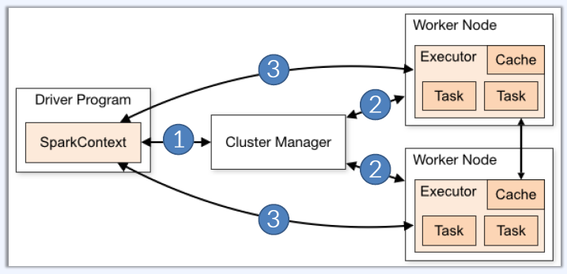

# 스파크 어플리케이션 구성

* 드라이버 프로그램 (로컬)
* 드라이버 프로그램 + 익시큐터 (클러스터)
* 모두가 각각 독립된 JVM 프로세스!



## 드라이버 프로그램

메인 함수가 실행되는 프로세스이며, 사용자 코드를 태스크로 변환하여 클러스터로 전송함.  

1. 연산들의 관계를 DAG(Directed Acyclic Graph)로 생성
2. DAG를 물리적인 실행 계획으로 변환  
최적화를 거쳐 여러개의 스테이지로 변환되며, 각 스테이지는 여러 태스크로 구성
3. 단위 작업을 묶어서 클러스터로 전송

익시큐터에서 태스크가 도는 타이밍의 스케쥴링/모니터링도 담당!

* 익시큐터들은 시작 시 드라이버에 등록.
* 드라이버는 항상 실행 중인 익시큐터를 감시.
* 웹 UI를 통해 실행 정보 제공.

## 익시큐터

개별 태스크를 워커 노드에서 실행하는 프로세스임.  
태스크 실행 이후 결과를 드라이버로 전송하며, 캐시하는 RDD를 저장하기 위한 메모리 공간이 실제로 위치하는 곳이기도 함.  

드라이버 프로그램은 익시큐터를 할당받기 위해 클러스터 매니저(Standalone, Mesos, YARN, K8s)에 요청함.  

# 스파크 어플리케이션 배포

* spark-submit(스크립트), launcher(API)
* Local, (이후 모두 클러스터 대상 매니저)Standalone, Mesos, YARN, K8s

일반적인 케이스의 스파크 어플리케이션 라이프 사이클은 아래와 같음.  

1. spark-submit 이용해 어플리케이션 제출
2. spark-submit은 드라이버 프로그램 실행, 메인 함수 호출
3. 드라이버 프로그램이 클러스터 매니저에게 익시큐터 실행을 위한 리소스 요청
4. 클러스터 매니저가 익시큐터 실행
5. 드라이버 프로그램이 작업을 태스크 단위로 나누어 익시큐터에게 전송
6. 익시큐터가 태스크 실행, 결과를 드라이버에게 반환
7. 어플리케이션이 종료되면 클러스터 매니저에게 리소스 반납

# 스파크 어플리케이션 개발

* RDD 생성 → RDD 변환 → RDD 연산/저장
* Spark Shell, Web Notebook, IDE


## 스파크 컨텍스트

모든 스파크 프로그램은 스파크 컨텍스트로부터 시작함.  
모든 스파크 인터페이스의 공통 쓰레드이며, 스파크 클러스터와 연결을 대표하는 스파크의 가장 주된 엔트리 포인트!  
메모리, 코어 등의 주요 설정 값들을 모두 들고 있음.  
RDD 생성도 도맡아 하며, 잡의 시작과 취소를 할 수 있음.  
JVM, 즉 드라이버 프로그램마다 단 하나만 활성화 가능.  
RDD는 하나의 스파크 컨텍스트에만 존재할 수 있음. 컨텍스트 간 RDD 공유는 불가!

## RDD

Resilient Distributed Datasets, 줄여서 RDD임.  
병렬로 연산될 수 있는, 장애에도 대처가 가능한 객체(리니지와 Lazy Evaluation).  
스파크에서의 기본적인 데이터 단위.  

RDD의 동작은 두 가지가 있음. Transformation과 Action.  
Transformation 연산은 바로 실행되지 않으며, Action call 시 한 번에 수행됨.  
Transformation 연산은 자동으로 저장되지 않으며, Action call 될 때 마다 매번 수행됨. 단 이런 특징은 캐싱으로 무마가 가능.  
스토리지 / 메모리에 존재할 수 있음.  

## DataFrame, DataSet


* RDD  
  2014년 정식 출시된 스파크 v1은 RDD API 를 이용하여 데이터를 처리하였습니다.  
  RDD는 인메모리 데이터 처리를 통해 처리 속도를 높일 수 있었지만, 테이블 조인 효율화 같은 처리를 사용자가 직접 제어해야 했기 때문에 최적화에 어려움을 겪었습니다.
  ```
  // RDD 예제 
  val data = Array(1, 2, 3, 4, 5)
  val distData = sc.parallelize(data)
  distData.map(x => if(x >= 3) x else 0).reduce((x, y) => x + y)
  ```

* DataFrame
  데이터프레임은 스파크 1.3에서 처리 속도 증가를 위한 프로젝트 텅스텐의 일부로 소개 되었습니다.  
  데이터를 스키마 형태로 추상화 하고, 카탈리스트 옵티마이저가 쿼리를 최적화하여 처리합니다.
  ```
  // 데이터프레임 예제 
  val df = spark.read.json("examples/src/main/resources/people.json")
  df.select($"name", $"age").filter($"age" > 20).show()
  df.groupBy("age").count().show()
  ```

* Dataset  
  데이터셋은 스파크 1.6에서 추가 되었습니다.  
  데이터의 타입체크, 데이터 직렬화를 위한 인코더, 카탈리스트 옵티마이저를 지원하여 데이터 처리 속도를 더욱 증가시켰습니다.  
  스파크 2.0에서 데이터프레임과 데이터셋이 통합되었으며(현재 최신 버전은 3.3.2), 스칼라 API에서 Dataset[Row]는 DataFrame을 의미 합니다.  
  ```
  // 데이터셋 예제 
  val path = "examples/src/main/resources/people.json"
  case class Person(name:String, age:Long)
  val peopleDS = spark.read.json(path).as[Person]
  peopleDS.show()
  ```

(출처: https://wikidocs.net/28377)

## RDD 생성

* 메모리의 데이터로 생성  
  ```
  // Scala 예제
  val tupleRDD = sc.parallelize(Array(("u01", 100), ("u02", 200)))
  val longRDD = sc.range(1, 100, step=2, numSlices=10)
  ```
* 파일을 읽어 생성
  ```
  // Scala 예제
  val myRDD = sc.textFile("myLog.log")
  val bigRDD = sc.textFile("/log/202302/*.log")
  ```
* 다른 RDD에서 생성
  Transformation 동작을 통해 RDD를 생성함.  
  RDD의 전제는 내부 데이터가 불변이기 때문에, 데이터 변환이 필요한 경우 새 RDD를 만들고 원본 데이터를 변환한 결과를 저장함.  
  Action 동작의 경우 새 RDD를 만들지 않음.  
  * map 함수의 경우 원본 RDD의 각 레코드마다 함수를 돌려 그 결과로 새 RDD를 생성
  * filter 함수의 경우 원본 RDD의 각 레코드마다 함수를 돌려 그 결과와 패러미터로 들어온 boolean 조건에 맞는 레코드로만 새 RDD를 생성
  ```
  // Scala 예제
  val myRDD2 = myRDD.map(line => line.toUpperCase())
  val myRDD3 = myRDD2.filter(line => line.contains("HELLO!"))
  val myRDD4 = myRDD3.map(line => line.toLowerCase()).filter(line => line.contains("REALLY?"))
  ```

## RDDs on a Cluster

RDD는 분산 시스템에 존재하므로 데이터가 워커 노드 사이에 분산되어서 존재함.  
파티셔닝은 스파크 시스템이 알아서 진행(옵션으로 파티션 갯수는 지정 가능).  

단일 파일 데이터를 읽는다고 가정하자.  
사용자가 메서드를 부를 때 최소 파티션의 갯수도 패러미터로 넣어서 부를 수 있음.  
파티션이 더 많아질 수록 더 병렬화 수준이 높아짐.  
단, 익시큐터가 할당 받은 코어 수를 넘어서는 병렬화는 불가.  


여러 파일 데이터를 읽는다고 가정하자.  
각각의 파일의 크기가 좀 된다면, 각 파일은 최소한 하나의 파티션을 차지함.  
파일 크기가 작다면, 각 파일 이름과 내용을 pair 형태의 RDD를 만들어 맵을 만들어 운영함(key는 파일 이름, value는 파일 내용).  


## 파티션에서의 동작

대부분의 RDD 동작들은 각 RDD에 영향을 미침.  
하지만 파티션 단위로 동작을 하게 만들고 싶을 때가 있을텐데, 가능함.  
* foreachPartition 함수는 각 파티션 별로 함수를 동작하게 함.
* mapPartition 함수는 현재 RDD 기준으로 각 파티션의 모든 요소를 반복문으로 처리하고 새로운 RDD 파티션을 생성.
* mapPartitionsWithIndex 함수는 mapPartition 함수와 동일하지만 파티션 인덱스를 포함함.

## 파티션과 HDFS의 궁합


HDFS와 스파크가 같은 클러스터 위에서 돌고 있다고 가정하자.  
HDFS에서 파일은 블럭 단위로 저장함.  
블럭은 여러 노드에 퍼져있을 수 있는데, 스파크에서 이렇게 분산되어 있는 데이터를 불러들일 때는 기본적으로 분산되어 있는 블럭 기준으로 파티션을 나눠서 같은 노드 안에서 블럭을 읽어들이도록 유도함.  
이는 네트워크 부하를 최소한으로 줄이기 위함.  

## 파티션에서의 병렬 연산

파티션 단위로 태스크는 실행된다.  
파티션 하나에 태스크 하나가 매핑되며, 여러 파티션이 있기 때문에 스파크에서는 병렬 연산이 가능하다.  
파티션은 데이터를 나누는 단위지만, 쓰레드의 단위로 보아도 무방함!  

어떤 동작은 데이터의 파티션이 바뀌지 않고 유지됨: map, flatMap, filter  
어떤 동작은 데이터의 파티션이 바뀜: reduceByKey, sortByKey, join, groupByKey  

## 스테이지

스파크 잡에 대해 다시 한 번 확인하고 넘어가자.  


* 잡(Job)  
  스파크 애플리케이션으로 제출된 작업입니다.
* 스테이지(Stage)  
  잡을 작업의 단위에 따라 구분한 것이 스테이지입니다.
* 태스크(Task)  
  익스큐터에서 실행되는 실제 작업입니다. 데이터를 읽거나, 필터링 하는 실제 작업을 처리합니다.

하나의 스테이지에서는 모든 연산이 같은 파티션에서 이뤄진다.  
같은 스테이지 안의 태스크들은 같은 파이프라인으로 묶이며, 성능 향상을 위해서는 스테이지 구성에 주의해야 함.  


+) 요 과정 세미나 할 때, 90 페이지의 시리즈 그림을 활용해보자.

스테이지 안에서는 같은 파티션 안에서만 연산이 이뤄진다 했으니, 파티션이 재분배 되는 순간 스테이지가 바뀌어야 한다.  
따라서 위 그림에서 groupByKey 연산이 들어가는 순간 스테이지가 분리된다.  
앞선 스테이지가 다 끝난 이후에 다음 스테이지가 실행된다.  
따라서, 데이터 정렬이 이루어지는 타이밍마다 모든 병렬 연산이 강제로 조인되는 타이밍이 발생한다는 것!  
위 그림을 기준으로, 스테이지 0의 경우 4개의 파티션으로 나눠졌으며 4개의 병렬 태스크 연산이 이뤄지며, 스테이지 1의 경우 2개의 병렬 태스크 연산으로 처리된다.  

## 연산의 병렬화 수준 지정

연산을 진행할 때 파티션의 갯수를 지정할 수 있음.  

`scala > pairs.reduceByKey((a, b) => a+b, 15)`  

아니면 스파크 기본 설정에서 파티션을 지정할 수 있음: `spark.default.parallelism`
여기서 마지막 패러미터인 15가 15개 파티션으로 나누어 연산을 수행하라는 뜻.  
하지만 Key가 2개 밖에 없다면? 파티션 중 2개에만 데이터가 쌓이고 나머지는 무의미한 파티션이 되어 자원만 잡아먹는다.  
내가 다룰 데이터의 복잡도를 잘 생각해서 파티션을 잡도록 하자.  

# 스파크 함수형 프로그래밍

RDD의 많은 동작들은 패러미터로 함수를 받음.  
이는 RDD에서 동작할 내용을 패러미터로 정의한다는 의미.  
이를 수도 코드로 표현하면 아래와 같음.  

```
RDD {
  map(fn(x)) {
    foreach record in rdd {
      emit fn(record)
    }
  }
}
```

# RDD 프로그래밍

RDD는 어떤 타입이든 serializable 하다면 담을 수 있음.

* 정수형, 글자, 불린 타입같은 Primitie types
* 리스트, 배열같은 Sequence types
* Java/Scala 객체 (Serializable해야 함)

어떤 RDD는 추가 기능을 포함하거나 특정 타입에 특화되어 있음.  

* Pair RDDs: key-value 쌍을 저장할 수 있음
* Double RDDs: 숫자 데이터만 담을 수 있음.

파일 읽는 것 뿐 아니라 메모리에서도 RDD를 만들 수 있음.  
`scala > val distData = sc.parallelize(Array(1, 2, 3, 4, 5))`

파일을 읽을 때, 단일 파일, 여러 파일 모두 읽을 수 있음.  

```
sc.textFile("myFile.txt")
sc.textFile("myData/")
sc.textFile("myData/*.log")
sc.textFile("myFile1.txt,myFile2.txt")
```

일반 텍스트 파일의 경우, `sc.textFile(...)` 함수를 사용하며, `\n`, 즉 새 줄 기호마다 데이터를 나눠 새 element로서 본다.  
JSON 파일 등의 데이터를 읽을 때는 `sc.wholeTextFiles(...)` 함수를 써야 함.  

## Pair RDDs


RDD의 특수한 형태이며, 모든 element가 key-value 쌍 형태.  
Sort, Join, Group, Count 등의 기능을 수행할 때 사용자 입장에서 많은 추가 연산을 할 수 있음.  


## Map-Reduce

앞의 하둡 강의에서 본 것 처럼, 맵리듀스는 분산 환경에서의 연산을 위한 가장 일반적인 프로그래밍 모델.  
스파크는 맵리듀스 연산 형태를 하둡 맵리듀스보다 유연하게 사용이 가능.  

스파크에서 맵리듀스 연산을 하기 위해서는 데이터가 페어 RDD 형태로 구성되어 있어야 함.  

* 맵 페이즈  
  한 번에 한 레코드에 대해서 동작.  
  각 레코드를 하나 혹은 여러 새로운 레코드에 매핑 시킴.  
  map, flatMap, filter, keyBy 등의 연산이 있음.  
* 리듀스 페이즈
  맵 페이즈의 결과를 가지고 동작.  
  여러 레코드를 통합시킴.  
  reduceByKey, sortByKey, mean 등의 연산이 있음.  

아래 예제는 Word Count 동작을 스파크로 구현한 것.  


## RDD Transformation 연산 일람

RDD = {1, 2, 3, 3} 형태로 가정해보자.

* map(): RDD 안의 각 요소마다 연산을 하고 그 결과 RDD를 리턴.  
  ```
  RDD.map(x => x + 1) // {2, 3, 4, 4}
  ```
* flatMap(): RDD 안의 각 요소마다 연산을 하고 그 결과 rDD를 리턴.  
  단, 연산은 반복문도 가능하며, 요소마다 진행한 연산 결과가 iterable하다면 각 요소를 새 RDD의 요소 하나 하나로 분리함.  
  ```
  RDD.flatMap(x => x.to(3)) // {1, 2, 3, 2, 3, 3, 3}
  ```

두 함수의 차이를 더 잘 알기 위해 하나의 예시를 더 들어보자.

```
rdd = sc.parallelize([
    'a,b,c',
    'd,e,f',
    'g,h,i'
])

map_rdd = rdd.map(lambda x: x.split(','))
print(map_rdd.collect())

flatmap_rdd = rdd.flatMap(lambda x: x.split(','))
print(flatmap_rdd.collect())

/*
* [['a', 'b', 'c'], ['d', 'e', 'f'], ['g', 'h', 'i']]
* ['a', 'b', 'c', 'd', 'e', 'f', 'g', 'h', 'i']
*/
```

* filter(): RDD 안의 요소 중 패러미터로 넘긴 조건에 맞는 항목만 리턴.  
  ```
  RDD.filter(x => x != 1) // {2, 3, 3}
  ```
* distinct(): RDD 안의 요소 중 중복을 삭제한 RDD를 리턴.  
  ```
  RDD.distict() // {1, 2, 3}
  ```
* union(): RDD 두 개를 합친 새 RDD를 리턴.  
  ```
  RDD2 = {3, 4, 5}
  RDD.union(RDD2) // {1, 2, 3, 3, 4, 5}
  ```
* intersection(): RDD 두 개 중 겹치는 항목만 가진 새 RDD를 리턴.  
  ```
  RDD2 = {3, 4, 5}
  RDD.intersection(RDD2) // {3}
  ```
* subtract(): RDD 항목 중 패러미터로 들어온 RDD 안에 있는 항목을 삭제한 새 RDD를 리턴.
  ```
  RDD2 = {3, 4, 5}
  RDD.subtract(RDD2) // {1, 2}
  ```
* cartesian(): RDD 항목 간 곱연산 결과 RDD를 리턴.
  ```
  RDD2 = {3, 4, 5}
  RDD.subtract(RDD2) // {(1, 3), (1, 4), (1, 5), (2. 3), (2, 4), (2, 5), (3, 3), (3, 4), (3, 5)}
  ```

## RDD Action 연산 일람

RDD = {1, 2, 3, 3} 형태로 가정해보자.

* collect(): RDD의 모둔 요소를 리턴.
  ```
  RDD.collect() // Array(1, 2, 3, 4)
  ```
* count(): RDD의 요소 갯수를 리턴.
  ```
  RDD.count() // 4
  ```
* countByValue(): RDD의 요소 값 별 등장 횟수를 리턴.
  ```
  RDD.countByValue() // Map(1 -> 1, 2 -> 1, 3 -> 2)
  ```
* take(num): RDD의 요소 중 앞 num 갯수만큼 리턴.
  ```
  RDD.take(2) // Array(1, 2)
  ```
* top(num): RDD의 요소 중 뒤 num 갯수만큼 리턴.
  ```
  RDD.top(2) // Array(3, 3)
  ```  
* reduce(): RDD의 요소 값을 다 합쳐 연산에 넣어 결과를 리턴.
  ```
  RDD.reduce((x, y) => x + y) // 9
  ```
* fold(0)(func): reduce 연산과 동일.
  ```
  RDD.fold(0)((x, y) => x + y) // 9
  ```
* foreach(): RDD의 요소에 돌아가며 연산을 수행한 결과를 리턴.
  ```
  RDD.foreach(x => print(x + ", ")) // 1, 2, 3, 3,
  ```

## Pair RDD Transformation 연산 일람

RDD = {(1, 2), (3, 4), (3, 6)} 형태로 가정해보자.

* reduceByKey(func): 같은 키 값을 기준으로 값을 합침.  
  합칠 때 동작은 func에 따름.  
  ```
  RDD.reduceByKey((x, y) => x + y) // {(1, 2), (3, 10)}
  ```
* groupByKey(func): 같은 키 값을 기준으로 값을 그루핑.  
  ```
  RDD.groupByKey((x, y) => x + y) // {(1, Array(2)), (3, Array(4, 6))}
  ```
* mapValues(func): 키 값은 그대로 두고, 밸류 값에 대해 연산을 수행.  
  ```
  RDD.mapValues(x => x + 1) // {(1, 3), (3, 5), (3, 7)}
  ```
* flatMapValues(func): 키 값은 그대로 두고, 밸류 값에 대해 연산을 수행하는데, 반복문 형태.  
  하나의 키 밸류 페어가 여러 아웃풋을 내놓을 수 있기 때문에, 원본 RDD보다 요소 갯수가 늘어날 수 있음.
  ```
  RDD.flatMapValues(x => x to 5) // {(1, 2), (1, 3), (1, 4), (1, 5), (3, 4), (3, 5)}
  ```
* keys: 키 값으로만 구성된 새 RDD를 생성.  
  ```
  RDD.keys // {1, 3, 3}
  ```
* values: 밸류 값으로만 구성된 새 RDD를 생성.  
  ```
  RDD.values // {2, 4, 6}
  ```
* sortByKey(): 키 값을 기준으로 정렬된 RDD를 리턴.  
  ```
  RDD.sortByKey() // {(1, 2), (3, 4), (3, 6)}
  ```
